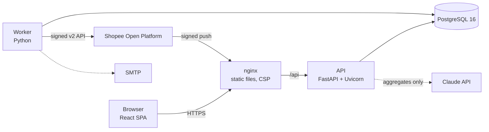
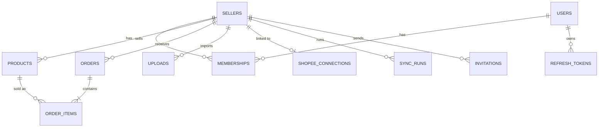

# Architecture

## Components



| Component | Responsibility |
|---|---|
| **nginx** | Serves the built React app, adds security headers (CSP, `nosniff`, `Referrer-Policy`), proxies `/api` to the API and overwrites `X-Forwarded-For` so the API can trust it. |
| **API** | Authentication, tenant resolution, validation, imports, metrics, alerts, team management, Shopee OAuth and webhook endpoints. Stateless; several replicas can run. |
| **Worker** | Runs Shopee syncs (queued by "Sync now", by push notifications or on a schedule) and the weekly e-mail digest. Writes a heartbeat file used by its healthcheck. |
| **PostgreSQL** | The only state: business data, sessions, rate-limit hits, the sync queue and advisory locks. Not published on the host. |

## Request flow

1. The browser keeps the access token (15-minute JWT) **in memory** and sends it as a bearer token, plus the active shop as `X-Shop-Id`.
2. `get_current_user` (FastAPI dependency) verifies the token, loads the user's **membership** in that shop and its role from the database, and returns an `Actor`. A shop the user does not belong to answers 403.
3. Every query filters by the actor's `seller_id`. A foreign id answers 404, like a missing one.
4. On a 401 the frontend calls `/api/auth/refresh` once. The refresh token lives in an HttpOnly, SameSite=Strict cookie and is rotated on every use; reusing an old one revokes the whole session family.

## Data model



- Money is `NUMERIC` in the database and a decimal string in JSON, never a float.
- Orders are unique per `(seller_id, external order id)`, which makes uploads and syncs idempotent.
- `(seller_id, ordered_at)` is the main index: every period filter is turned into a UTC range that uses it.

## Imports

1. The file is checked: size, real type (not just the extension), row limit, formula injection.
2. pandas reads CSV or XLSX; headers in Portuguese or English are mapped to one schema.
3. Pydantic validates each row; errors point to the row and column.
4. Buyer name, phone and address are dropped; the buyer username becomes an HMAC.
5. Rows are written in chunks of 2,000 orders with `INSERT … ON CONFLICT DO NOTHING` and bulk status updates.

## Shopee sync

```mermaid
sequenceDiagram
    participant UI
    participant API
    participant DB as PostgreSQL
    participant W as Worker
    participant S as Shopee
    UI->>API: POST /api/shopee/sync
    API->>DB: insert sync_run (queued)
    API-->>UI: 202 Accepted
    W->>DB: claim run (FOR UPDATE SKIP LOCKED)
    W->>DB: pg_advisory_lock(seller)
    W->>S: get_order_list (15-day windows), get_order_detail, get_escrow_detail
    W->>S: get_item_list, get_model_list (stock)
    W->>DB: upsert orders, items, stock; mark run success
    UI->>API: poll /api/shopee/status
```

A signed push notification from Shopee only queues a run; the payload is never used as data.

## The LLM feature

The weekly summary is built by `weekly_facts()`: a small JSON with this week's and last week's KPIs, the top five products, ABC counts and alert names. That JSON is the **only** input to Claude, and a test asserts that no order or customer data is in it. The model explains numbers; it never computes them.
